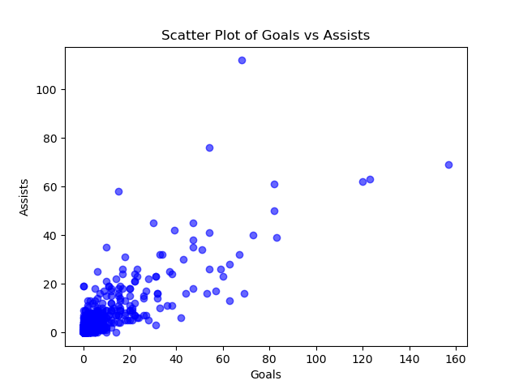

[](https://github.com/jayliu1016/Matrix_Build/actions/workflows/cicd.yml)
# jayliu_ids_Matrix_Build
python project
1. Set up a Gitlab Actions workflow
2. Test across at least 3 different Python versions
# Soccer Player Overview Analysis

This project analyzes soccer player data, including generating summary statistics and visualizations of the goals and assists data. The dataset contains player information, including appearances, goals, assists, clean sheets, and more.

## Project Structure

- **main.py**: This is the main script that:
  - Loads the dataset (`player_overview.csv`).
  - Prints the first few rows of the dataset to showcase the variables.
  - Generates summary statistics (mean, median, standard deviation, etc.) for the numerical variables like Goals, Assists, and Appearances.
  - Creates a scatter plot of Goals vs Assists for the players.
  - Saves the scatter plot as `Goals_Assists_Scatter.png`.

- **test_main.py**: This file contains test cases to verify the functionality of the main script, ensuring:
  - The `print_head()` function outputs the correct head of the dataset.
  - The `describe_stat()` function correctly generates summary statistics for the dataset.

- **player_overview.csv**: This is the dataset containing soccer player information such as Name, Nationality, Date of Birth, Height, Club, Position, Appearances, Goals, Assists, Clean Sheets, and Facebook interactions (if available).

## Requirements

- Python 3.x
- Pandas
- Matplotlib
- Pytest (for running tests)

## Installation

1. Clone the repository:
    ```bash
    git clone <repository-url>
    ```

2. Install the necessary Python packages:
    ```bash
    pip install -r requirements.txt
    ```

## Usage

1. **Run the analysis**:
    To run the main analysis and generate the scatter plot:
    ```bash
    python main.py
    ```

    This will:
    - Print the first few rows of the dataset.
    - Output the summary statistics (mean, median, standard deviation, etc.) for all numerical columns.
    - Create and display a scatter plot of **Goals vs Assists**, which will be saved as `Goals_Assists_Scatter.png`.

2. **Run the tests**:
    To verify the functionality of the main script:
    ```bash
    pytest test_main.py
    ```

## Example Outputs

### Scatter Plot: Goals vs Assists
A scatter plot showing the relationship between the number of goals and assists for each player:



### Summary Statistics:
The following is an example of the summary statistics for numerical columns such as Goals and Assists:

